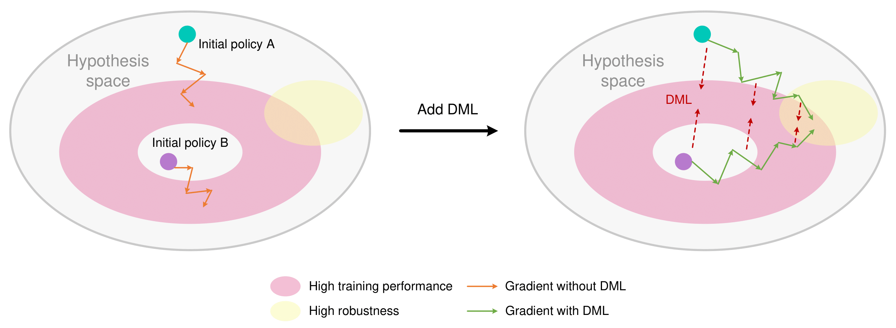

<h1 align="center">
	Representation Convergence:<br>Mutual Distillation is Secretly a Form of Regularization
</h1>

<p align="center">
  Zhengpeng Xie*, Jiahang Cao*, Qiang Zhang, Jianxiong Zhang, Changwei Wang, Renjing Xu
</p>

[arXiv](coming soon...)

# Main Results
<div align="center">
  
</div>

**Caption:** (Left) Independently trained reinforcement learning policies may overfit to spurious features. (Right) Through mutual distillation via DML, two policies regularize each other to converge toward a more robust hypothesis space, ultimately improving generalization performance.

<div align="center">
  
</div>

**Caption:** Generalization performance from 500 levels in Procgen benchmark with different methods. The mean and standard deviation are shown across 3 seeds. Our MDPO gains significant performance improvement compared with the baseline algorithms.

<div align="center">
  
</div>

**Caption:** The feature extraction of MDPO is highly stable and focused (red points), whereas the features extracted by the original PPO encoder are significantly dispersed (blue points).


# Installation
To ensure the reproducibility of our main results, please follow the steps below to install the dependencies.

Create Anaconda environment:
```bash
conda create -n procgen_py310 python=3.10 --yes
conda activate procgen_py310
```

Install the requirements:
```bash
pip install -r requirements.txt
```

Choose the CUDA version on the official PyTorch website: [https://pytorch.org/](https://pytorch.org/)
```bash
pip3 install torch torchvision torchaudio --index-url https://download.pytorch.org/whl/cu121
```

Train MDPO:
```bash
python main.py
```

Train PPO:
```bash
python ppo.py
```

# Acknowledgement
The code is based on [cleanrl](https://github.com/vwxyzjn/cleanrl/blob/master/cleanrl/ppo_procgen.py). The implementation of Mutual Distillation Policy Optimization (MDPO) is divided into multiple components to enhance readability.
